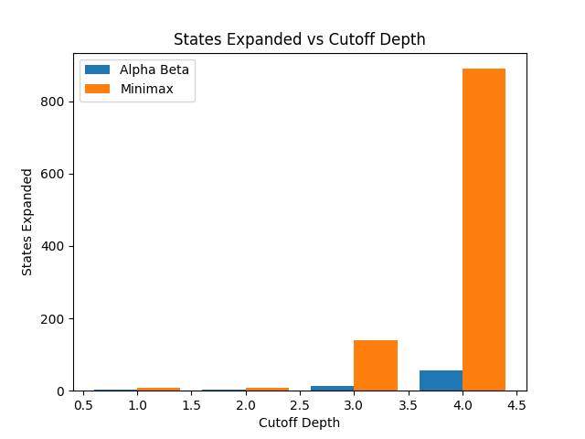
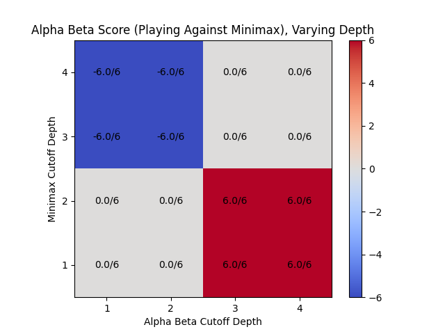
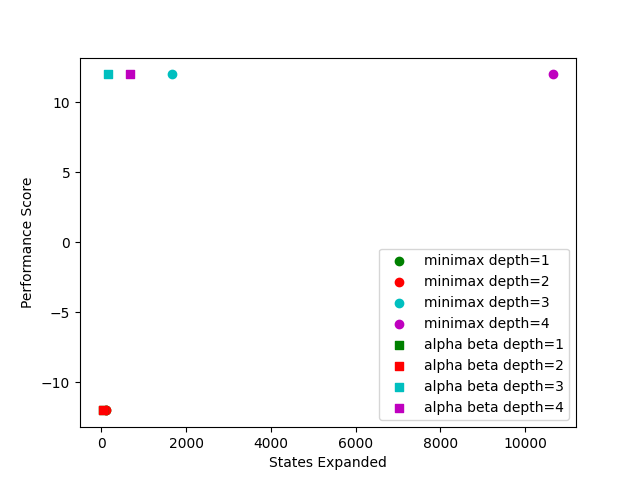
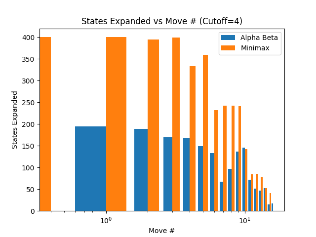

# Adversarial Search: Minimax vs Alpha-Beta Pruning

## Overview

This project implements and analyzes adversarial search algorithms for two-player, zero-sum games, focusing on **Minimax** and **Alpha-Beta Pruning**.

Using Tic-Tac-Toe and Connect Four as test environments, I evaluate how search depth impacts both **computational cost (states explored)** and **game performance**, and demonstrate how alpha-beta pruning improves efficiency without sacrificing optimality.

---

## Algorithms

### Minimax

Minimax is a recursive search algorithm that explores the full game tree under the assumption that both players act optimally. While it guarantees optimal decisions, its computational cost grows exponentially with search depth.

### Alpha-Beta Pruning

Alpha-beta pruning is an optimization of minimax that eliminates branches of the search tree that cannot affect the final decision. This significantly reduces the number of states explored while preserving optimality.

### Depth Cutoff + Heuristic Evaluation

To make deeper search feasible, both algorithms use a cutoff depth. When the cutoff is reached, a heuristic function evaluates non-terminal states to approximate their value.

---

## Experimental Setup

* **Games:** Tic-Tac-Toe, Connect Four
* **Algorithms Compared:** Minimax vs Alpha-Beta
* **Metrics:**

  * States expanded (computational cost)
  * Game outcome (performance)
* **Parameters:**

  * Search depth: 1–4
  * Multiple trials per configuration

---

## Results

### State Expansion vs Depth

Alpha-beta pruning significantly reduces the number of states explored compared to minimax at all depths. While both algorithms exhibit exponential growth as depth increases, alpha-beta consistently expands fewer nodes, enabling more efficient search.



---

### Performance Comparison

At equal search depths, alpha-beta achieves similar performance to minimax, confirming that pruning does not affect optimal decision-making. However, because alpha-beta is more efficient, it enables deeper search within the same computational limits, leading to stronger gameplay.



---

### Performance vs Computational Cost

There is a clear tradeoff between computational cost and performance: deeper search leads to better outcomes but requires significantly more computation. Alpha-beta pruning improves this tradeoff by reducing the cost required to reach higher-performing strategies.



---

### States Expanded per Move

Search cost varies throughout the game, with later moves often requiring more computation. Across all stages, alpha-beta consistently expands fewer states per move than minimax.



---

## Key Takeaways

* Alpha-beta pruning significantly reduces state expansion without sacrificing optimality
* Search depth is the primary driver of performance in adversarial games
* Efficient pruning enables deeper search within fixed computational constraints
* There is a clear tradeoff between computational cost and gameplay performance

---

## Project Structure

```
.
├── adversarial_search.py
├── agents.py
├── compare_performance.py
├── game_runner.py
├── heuristic_adversarial_search_problem.py
├── adversarial_search_problem.py
├── *.png (results)
└── README.md
```

---

## How to Run

1. Install dependencies:

```bash
pip install -r requirements.txt
```

2. Run experiments:

```bash
python compare_performance.py --game connect4 --max_depth 4 --n_trials 3
```

3. Output:

* Performance plots will be saved as `.png` files in the project directory

---

## Future Improvements

* Add runtime (execution time) analysis in addition to state expansion
* Implement transposition tables (caching) to further optimize search
* Improve heuristic functions for stronger gameplay performance
* Extend experiments to larger or more complex games

---
